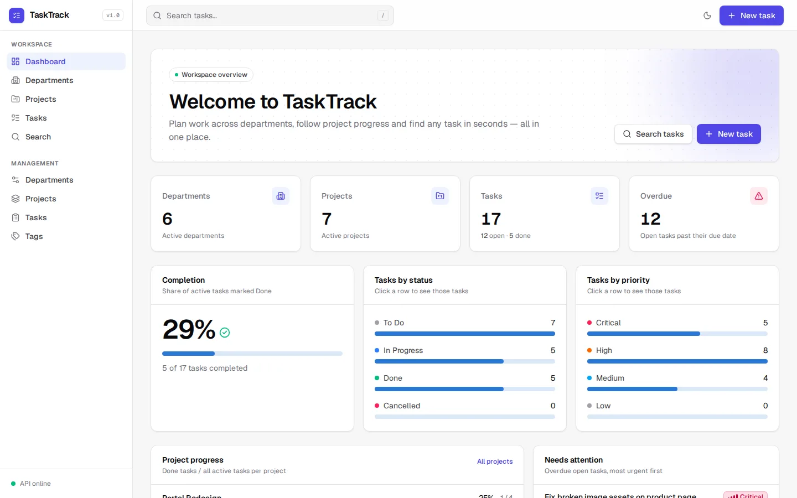
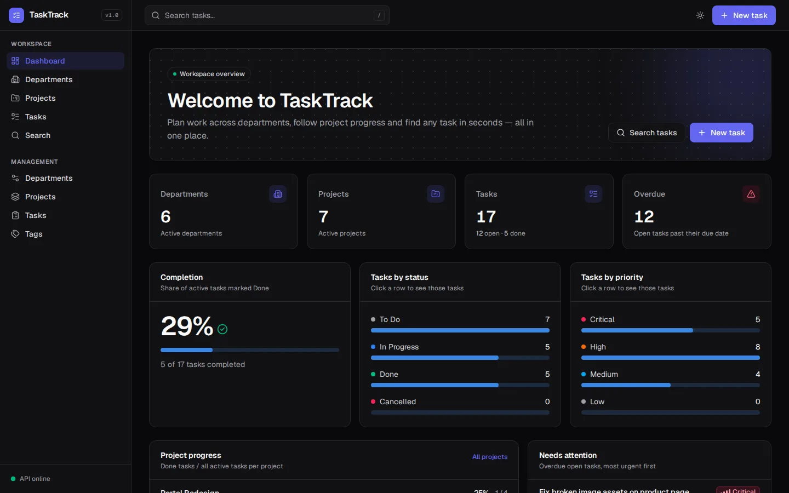
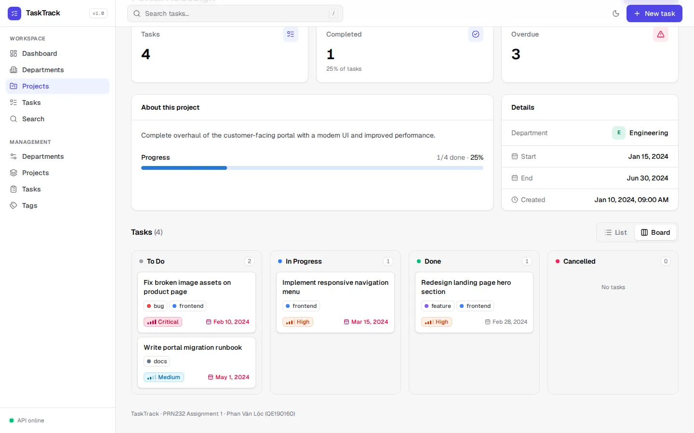
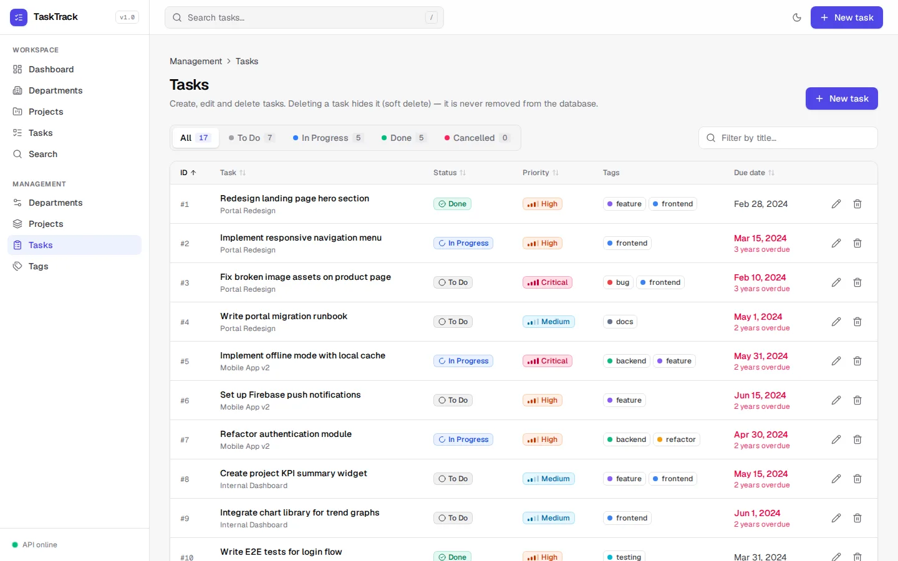
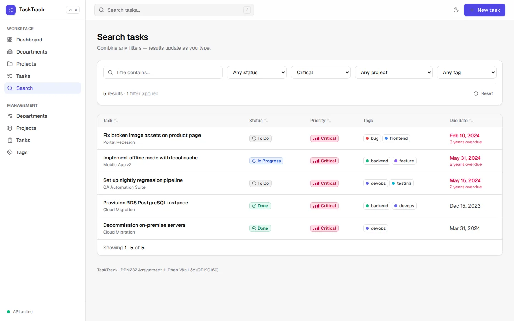
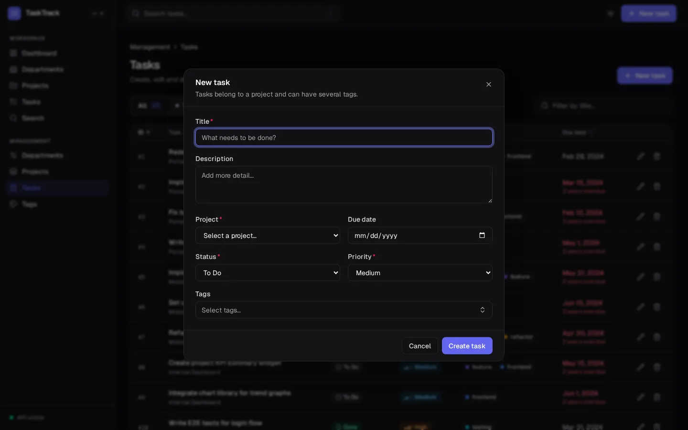
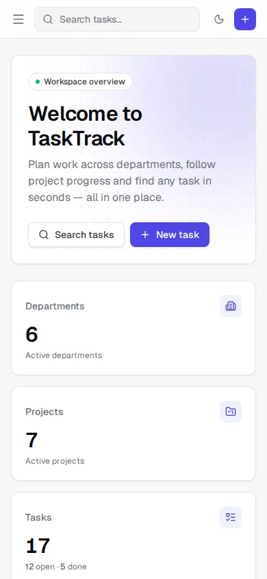
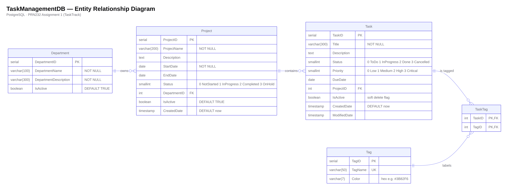
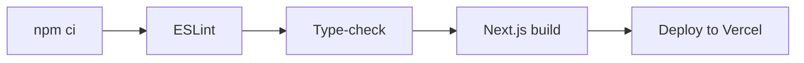

<div align="center">

# TaskTrack Web

**PRN232 · Assignment 1: Task & Team Management (Frontend)**

The web client for TaskTrack — a dashboard-style app built with **Next.js 15 (App Router)**, **React 19**, **TypeScript** and **Tailwind CSS 4**. Every page loads real data from the TaskTrack API.

[](https://github.com/kaine45-cyber/Assignment_PRN232_PhanVanLoc_QE190160/actions/workflows/frontend.yml)


</div>

| | |
|---|---|
| **Live site** | `https://<your-app>.vercel.app` |
| **Backend (same repository)** | [`backend/`](../backend) |
| **Backend API (Swagger)** | `https://<your-service>.onrender.com/swagger` |

> The backend runs on Render's free tier, so the first request after a period of inactivity can take up to a minute. The UI shows a loading state meanwhile.

## Contents

- [Screenshots](#screenshots)
- [Pages](#pages)
- [UI & UX](#ui--ux)
- [Data model](#data-model)
- [Project structure](#project-structure)
- [Running locally](#running-locally)
- [Scripts](#scripts)
- [Environment variables](#environment-variables)
- [CI/CD](#cicd)
- [Deployment](#deployment)
- [Assignment bonus features](#assignment-bonus-features)
- [Author](#author)

## Screenshots

| Dashboard (light) | Dashboard (dark) |
|---|---|
|  |  |
| **Project detail – Kanban board** | **Task management** |
|  |  |
| **Search with live filters** | **Create task modal (dark)** |
|  |  |

<p align="center"></p>

## Pages

### Public

| Route | Description |
|---|---|
| `/` | Dashboard: welcome banner, KPI cards (departments, projects, tasks, overdue), completion meter, *tasks by status / priority* charts, per-project progress, overdue list and active projects as cards |
| `/departments` | Active departments as cards, with a live name search |
| `/departments/[id]` | Department info, project / task counts and its projects |
| `/projects` | Active projects, filterable by name, status and department |
| `/projects/[id]` | Project details, progress, stats and its tasks as a **sortable table or a Kanban board** (status badge, priority badge, tags, due date) |
| `/tasks` | Every active task with a **status filter** (tabs with counts), priority and title filters, sorting and pagination |
| `/tasks/[id]` | All fields of a task including tags, with an overdue warning |
| `/search` | Filter tasks by title, status, priority, project and tag. Results update as filters change and are synced to the URL (shareable) |

### Management (public CRUD)

| Route | Features |
|---|---|
| `/departments/manage` | Sortable table, create / edit in a modal, delete with confirmation, active/inactive filter |
| `/projects/manage` | Sortable table, create / edit in a modal (date-range validation), delete with confirmation, status & department filters |
| `/tasks/manage` | Sortable table, create / edit in a modal with **tag multi-select**, **soft delete** with confirmation, status tabs. `?new=1&projectId=` deep link opens the create form |
| `/tags/manage` | Sortable table, color picker with presets and live preview, delete with confirmation |

## UI & UX

- **App shell** — fixed sidebar navigation (drawer on mobile), top bar with global task search (press <kbd>/</kbd>), quick "New task" action and a live **API status** indicator (the Render instance may be asleep).
- **Light & dark theme** — design tokens as CSS variables, toggle in the top bar, remembers the choice and follows the OS by default.
- **Badges, not numbers** — status badges carry an icon + label, priority badges a 4-step signal indicator, so meaning never relies on colour alone.
- **Data tables** — generic `DataTable` with sortable columns, pagination and empty states; switches to compact cards on small screens.
- **Charts** — lightweight, dependency-free bar lists and meters built from a validated data-viz palette.
- **Feedback** — skeleton loaders and spinners during requests, [Sonner](https://sonner.emilkowal.ski/) toasts after every create / update / delete (including API `400` messages such as *"still has projects linked"*).
- **Dialogs** — [Radix UI](https://www.radix-ui.com/) modals and confirmation dialogs (focus-trapped, <kbd>Esc</kbd> to close).
- **Validation** — React Hook Form + Zod on the client; field errors returned by the API are shown under the matching input.
- **Responsive** — tested at 375 px, 390 px and 1440 px with no horizontal scrolling.

## Data model



## Project structure

```
.
├── app/                        App Router routes
│   ├── page.tsx                Dashboard
│   ├── departments/            List, [id] detail, manage
│   ├── projects/               List, [id] detail (table / board), manage
│   ├── tasks/                  List (status filter), [id] detail, manage
│   ├── tags/manage/            Tag management
│   ├── search/                 Task search
│   └── layout.tsx              Fonts, theme bootstrap, app shell, toaster
├── components/
│   ├── layout/                 AppShell, Sidebar, Topbar, ThemeToggle, ApiStatus
│   ├── ui/                     DataTable, Modal, ConfirmDialog, Card, StatCard, BarList, Meter, Segmented, FormField, feedback states
│   ├── forms/                  DepartmentForm, ProjectForm, TaskForm, TagForm (React Hook Form + Zod)
│   └── *.tsx                   Badges, ProjectCard, TaskBoard, TaskColumns, TagMultiSelect, DepartmentAvatar
├── lib/
│   ├── api.ts                  Typed API client (endpoints, error parsing, health check)
│   ├── types.ts                DTO types matching the backend contract
│   ├── constants.ts            Status / priority labels and badge colours
│   ├── useFetch.ts             Data-fetching hook (loading / error / reload) + useDebounce
│   ├── useCrudDialogs.ts       Shared create / edit / delete dialog state for management pages
│   ├── forms.ts                Maps server validation errors onto form fields
│   └── utils.ts                Dates, overdue detection, percentages, helpers
└── docs/                       ERD and screenshots used in this README
```

## Running locally

```bash
cp .env.example .env.local     # point NEXT_PUBLIC_API_URL at the backend
npm install
npm run dev                    # http://localhost:3000
```

The [backend](../backend) must be running, and it must allow `http://localhost:3000` in its CORS settings. That origin is allowed by default.

## Scripts

| Command | Description |
|---|---|
| `npm run dev` | Start the development server |
| `npm run build` | Create a production build |
| `npm run start` | Serve the production build |
| `npm run lint` | Run ESLint (Next.js core-web-vitals + TypeScript rules) |
| `npm run typecheck` | Run the TypeScript compiler without emitting files |

## Environment variables

| Variable | Example | Description |
|---|---|---|
| `NEXT_PUBLIC_API_URL` | `https://tasktrack-api.onrender.com` | Backend base URL, with no trailing slash and without `/api` |

## CI/CD

The pipeline is defined in [`.github/workflows/frontend.yml`](../.github/workflows/frontend.yml) at the repository root. It only runs when files under `frontend/` change.



| Trigger | What runs |
|---|---|
| Pull request to `main` | Install, lint, type-check and production build |
| Push to `main` | The same steps, then a production deploy to Vercel |
| Manual (`workflow_dispatch`) | The same as a push |

- **Deployment is gated by CI.** The deploy job runs only after the quality job succeeds.
- **The deploy job is optional.** If the Vercel secrets are missing, the job skips with a notice instead of failing. Vercel's Git integration can deploy the site in that case.
- **Dependabot** opens weekly PRs for npm updates and monthly PRs for GitHub Actions updates.

| Name | Type | Where to find it |
|---|---|---|
| `VERCEL_TOKEN` | Secret | Vercel → Account Settings → Tokens |
| `VERCEL_ORG_ID` | Secret | `orgId` in `.vercel/project.json`, created by `npx vercel link` |
| `VERCEL_PROJECT_ID` | Secret | `projectId` in `.vercel/project.json` |
| `BACKEND_URL` | Variable (optional) | The Render URL. CI injects it as `NEXT_PUBLIC_API_URL` at build time |

> If you deploy through GitHub Actions, disable Vercel's Git-triggered deployments to avoid building twice.

## Deployment

The app is deployed on **Vercel**:

1. Import this repository and set **Root Directory** to `frontend`. Vercel detects Next.js automatically.
2. Add `NEXT_PUBLIC_API_URL` under Project → Settings → Environment Variables.
3. Deploy, then add the Vercel domain to the backend's `CORS_ORIGINS`.

Deployments can also be run from GitHub Actions once the `VERCEL_*` secrets are set. See [CI/CD](#cicd).

## Assignment bonus features

| Bonus item (Assignment 1) | Where |
|---|---|
| Status filter on the task list page | [`app/tasks/page.tsx`](app/tasks/page.tsx) — status tabs with live counts (also on `/tasks/manage`) |
| GitHub Actions CI on every push | [`.github/workflows/frontend.yml`](../.github/workflows/frontend.yml) — ESLint, TypeScript type-check, production build; Vercel deploy on `main` |
| ERD diagram image in the README | [`docs/erd.png`](docs/erd.png) (see [Data model](#data-model)) |

## Author

**Phan Văn Lộc** · QE190160 · SE19B
PRN232 · Assignment 1
