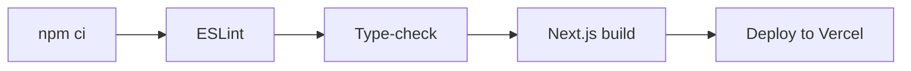

<div align="center">

# TaskTrack Web

**PRN232 · Assignment 1: Task & Team Management (Frontend)**

The web client for TaskTrack, built with **Next.js 15 (App Router)**, **React 19**, **TypeScript** and **Tailwind CSS 4**. Every page loads real data from the TaskTrack API.

[](https://github.com/kaine45-cyber/Assignment_PRN232_PhanVanLoc_QE190160_FE/actions/workflows/ci-cd.yml)


</div>

| | |
|---|---|
| **Live site** | `https://<your-app>.vercel.app` |
| **Backend repository** | [Assignment_PRN232_PhanVanLoc_QE190160](https://github.com/kaine45-cyber/Assignment_PRN232_PhanVanLoc_QE190160) |
| **Backend API (Swagger)** | `https://<your-service>.onrender.com/swagger` |

> The backend runs on Render's free tier, so the first request after a period of inactivity can take up to a minute. The UI shows a loading state meanwhile.

## Contents

- [Pages](#pages)
- [UI & UX](#ui--ux)
- [Project structure](#project-structure)
- [Running locally](#running-locally)
- [Scripts](#scripts)
- [Environment variables](#environment-variables)
- [CI/CD](#cicd)
- [Deployment](#deployment)
- [Author](#author)

## Pages

### Public

| Route | Description |
|---|---|
| `/` | Welcome banner, summary counts (departments, projects, tasks) and active projects as cards |
| `/departments` | Active departments, with a name search |
| `/departments/[id]` | Department information and its projects |
| `/projects` | Active projects, filterable by name, status and department |
| `/projects/[id]` | Project details, completion progress and a task list with status and priority badges, tags and due dates |
| `/tasks` | Task list with a status filter |
| `/tasks/[id]` | Every field of a single task, including its tags |
| `/search` | Filter tasks by title, status, priority, project and tag. Results update live, and the filters are kept in the URL |

### Management (public CRUD)

| Route | Features |
|---|---|
| `/departments/manage` | Table with create and edit in a modal, and delete with confirmation |
| `/projects/manage` | Table with create and edit in a modal (date-range validation), and delete with confirmation |
| `/tasks/manage` | Table with create and edit in a modal, **tag multi-select**, **soft delete** with confirmation, and a status filter |
| `/tags/manage` | Table with a color picker, preset colors, a live preview, and delete with confirmation |

## UI & UX

- **Badges.** Status and priority appear as colored badges. Overdue tasks are highlighted in red.
- **Loading states.** Pages show skeletons and spinners while data loads, and a message explains the backend's cold start.
- **Toasts.** A toast notification ([Sonner](https://sonner.emilkowal.ski/)) confirms the result of every create, update and delete.
- **Confirmation dialogs.** Built on [Radix UI Dialog](https://www.radix-ui.com/), so they are accessible and keyboard friendly.
- **Validation.** Forms are validated on the client with React Hook Form and Zod. Field errors returned by the API are shown under the matching input.
- **Responsive layout.** Desktop pages use tables, mobile pages use cards, and the navbar collapses into a hamburger menu.

## Project structure

```
.
├── app/                      App Router routes
│   ├── page.tsx              Home
│   ├── departments/          List, [id] detail, manage
│   ├── projects/             List, [id] detail, manage
│   ├── tasks/                List, [id] detail, manage
│   ├── tags/manage/          Tag management
│   ├── search/               Task search
│   └── layout.tsx            Navbar, footer, toaster
├── components/               Badges, Modal, ConfirmDialog, TagMultiSelect, TaskList, ProjectCard, feedback states
└── lib/
    ├── api.ts                Typed API client (single source of truth for endpoints, error parsing)
    ├── types.ts              DTO types shared with the backend contract
    ├── constants.ts          Status / priority labels and badge colors
    ├── useFetch.ts           Data-fetching hook (loading / error / reload) and useDebounce
    ├── forms.ts              Maps server validation errors onto form fields
    └── utils.ts              Date formatting, overdue detection, class helpers
```

## Running locally

```bash
cp .env.example .env.local     # point NEXT_PUBLIC_API_URL at the backend
npm install
npm run dev                    # http://localhost:3000
```

The [backend](https://github.com/kaine45-cyber/Assignment_PRN232_PhanVanLoc_QE190160) must be running, and it must allow `http://localhost:3000` in its CORS settings. That origin is allowed by default.

## Scripts

| Command | Description |
|---|---|
| `npm run dev` | Start the development server |
| `npm run build` | Create a production build |
| `npm run start` | Serve the production build |
| `npm run lint` | Run ESLint (Next.js core-web-vitals + TypeScript rules) |
| `npm run typecheck` | Run the TypeScript compiler without emitting files |

## Environment variables

| Variable | Example | Description |
|---|---|---|
| `NEXT_PUBLIC_API_URL` | `https://tasktrack-api.onrender.com` | Backend base URL, with no trailing slash and without `/api` |

## CI/CD

The pipeline is defined in `.github/workflows/ci-cd.yml` and runs on GitHub Actions.



| Trigger | What runs |
|---|---|
| Pull request to `main` | Install, lint, type-check and production build |
| Push to `main` | The same steps, then a production deploy to Vercel |
| Manual (`workflow_dispatch`) | The same as a push |

- **Deployment is gated by CI.** The deploy job runs only after the quality job succeeds.
- **The deploy job is optional.** If the Vercel secrets are missing, the job skips with a notice instead of failing. Vercel's Git integration can deploy the site in that case.
- **Dependabot** opens weekly PRs for npm updates and monthly PRs for GitHub Actions updates.

| Name | Type | Where to find it |
|---|---|---|
| `VERCEL_TOKEN` | Secret | Vercel → Account Settings → Tokens |
| `VERCEL_ORG_ID` | Secret | `orgId` in `.vercel/project.json`, created by `npx vercel link` |
| `VERCEL_PROJECT_ID` | Secret | `projectId` in `.vercel/project.json` |
| `BACKEND_URL` | Variable (optional) | The Render URL. CI injects it as `NEXT_PUBLIC_API_URL` at build time |

> If you deploy through GitHub Actions, disable Vercel's Git-triggered deployments to avoid building twice.

## Deployment

The app is deployed on **Vercel**:

1. Import this repository. Vercel detects Next.js automatically.
2. Add `NEXT_PUBLIC_API_URL` under Project → Settings → Environment Variables.
3. Deploy, then add the Vercel domain to the backend's `CORS_ORIGINS`.

Deployments can also be run from GitHub Actions once the `VERCEL_*` secrets are set. See [CI/CD](#cicd).

## Author

**Phan Văn Lộc** · QE190160 · SE19B
PRN232 · Assignment 1
